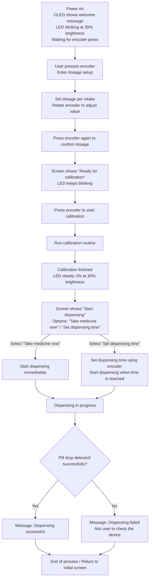

```
Pill_Dispenser_Project/
├── CMakeLists.txt              
├── README.md                   # Introduction
├── docs/                       # no-code documents
│   ├── flowchart.md            # Operating principles
│   ├── reflection.md           # Reflection/Division of work
│   ├── lora_commands.md        # LoRa AT
│   ├── lorareceive.py          # Example code to verify LoRa connection
│   └── images/                 # screenshots and else
│     
├── src/                        
│   ├── main.c                  
│   ├── config.h                # GPIO
│   ├── drivers/                
│   │   ├── motor.c             # Stepper Motor
│   │   ├── motor.h
│   │   ├── sensors.c           # Opto Fork & Piezo
│   │   ├── sensors.h
│   │   ├── lora.c              # LoRaWAN via UART
│   │   ├── lora.h
│   │   ├── eeprom.c            # I2C EEPROM
│   │   ├── eeprom.h
│   │   ├── ui.c                # LEDs & Button
│   │   └── ui.h
│   └── logic/                  
│       ├── dispenser.c         # calibration, statemachine
│       └── dispenser.h
```

Project Workflow:
