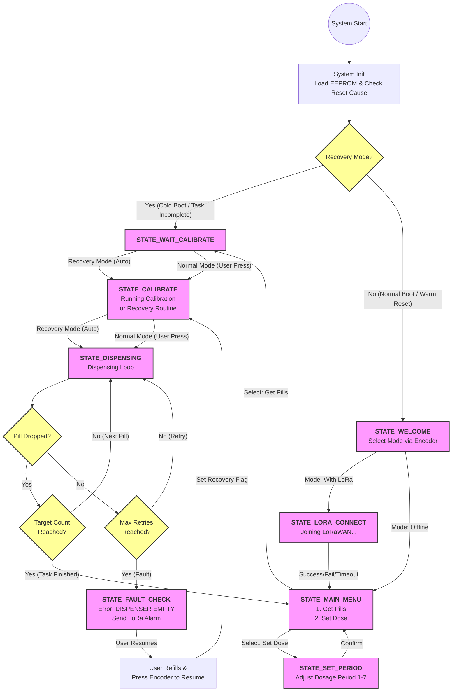

# Pill Dispenser SmartIoT Project

This is a Smart IoT Pill Dispenser project based on the Raspberry Pi Pico W. The device is designed to automatically dispense medication according to a set schedule. It features a local user interface with an OLED display and rotary encoder, and supports LoRaWAN connectivity for remote monitoring of device status and dispensing records.

## ✨ Features

* **Automated Dispensing Control**: Precisely controls a stepper motor to rotate the pill wheel, supporting a configurable dosage period of 1-7 days.
* **Dual Sensor Verification**:
    * **Optical Sensor (Opto-fork)**: Used for wheel position calibration and zero-point detection.
    * **Piezo Sensor**: Detects if a pill has successfully dropped into the chute.
* **LoRaWAN Remote Monitoring**: Reports device status (e.g., dispense success, empty alarm, reboot) via LoRaWAN (OTAA mode).
* **Power-off Recovery**: Saves the current state (pill count, calibration status) to EEPROM. On reboot, the device automatically recovers its progress and recalibrates without losing data.
* **Local User Interface**: Equipped with an OLED display, rotary encoder, and LED indicators for intuitive operation.
* **Fault Detection**: Includes detection for empty dispenser, motor stall protection, and automatic retry mechanisms.

## 🛠️ Hardware Requirements

* **Microcontroller**: Raspberry Pi Pico W
* **Driver**: Stepper Motor Driver Board
* **Motor**: Stepper Motor
* **Sensors**:
    * Optical Sensor (Opto-fork)
    * Piezo Vibration Sensor
* **Communication**: LoRaWAN Module (AT command compatible)
* **Display**: SSD1306 OLED Display (I2C)
* **Storage**: I2C EEPROM (e.g., AT24C256)
* **Input**: Rotary Encoder and Buttons

## 🔌 Pin Mapping

Based on `src/config.h` and the project documentation:

| Component | Function | Pico GPIO Pin | Notes                      |
| :--- | :--- | :--- |:---------------------------|
| **Stepper Motor** | IN1 / IN2 / IN3 / IN4 | GP2, GP3, GP6, GP13 | Motor Driver Inputs        |
| **Sensors** | Opto Sensor (Fork) | GP28 | Input with Pull-up         |
| | Piezo Sensor | GP27 | Input with Pull-up         |
| **LoRaWAN** | UART TX | GP4 | Connects to Module RX      |
| | UART RX | GP5 | Connects to Module TX      |
| **OLED Display** | I2C1 SDA | GP14 | `src/config.h`             |
| | I2C1 SCL | GP15 | `src/config.h`             |
| **EEPROM** | I2C0 SDA | GP16 | `src/config.h`             |
| | I2C0 SCL | GP17 | `src/config.h`             |
| **Encoder** | Pin A | GP10 | `src/config.h`             |
| | Pin B | GP11 | `src/config.h`             |
| | Switch (Button) | GP12 | `src/config.h`             |
| **LEDs** | LED 2 / 1 / 0 | GP20, GP21, GP22 | Status Indicators          |
| **Buttons** | SW 2 / 1 / 0 | GP7, GP8, GP9 | Auxiliary Controls         |

## 🚀 Getting Started

### 1. Prerequisites
Ensure you have the [Raspberry Pi Pico SDK](https://github.com/raspberrypi/pico-sdk) and CMake build tools installed.

### 2. Configure LoRaWAN Keys
Before building, you must configure your LoRaWAN AppKey.
1.  Copy the template file: `src/drivers/appkey_templete.h` -> `src/drivers/appkey.h`
2.  Edit `src/drivers/appkey.h` and insert your 32-character hexadecimal key:
    ```c
    #define APP_KEY "YOUR_32_HEX_CHAR_APP_KEY_HERE"
    ```

### 3. Build the Project
```bash
mkdir build
cd build
cmake ..
make
```

## Project Structure
```text
Pill_Dispenser_Project/
├── CMakeLists.txt              # CMake build configuration
├── README.md                   # Project documentation
├── lorareceive.py              # Python script for LoRaWAN data reception
├── .gitignore                  # Git ignore rules
├── docs/                       # Documentation files
│   ├── flowchart.md            # Detailed operation flowchart
│   ├── lora_commands.md        # LoRa AT commands reference
│   └── ...
├── src/                        # Source code
│   ├── main.c                  # Entry point (System Init & Main Loop)
│   ├── config.h                # GPIO mappings and global configuration
│   ├── drivers/                # Hardware Abstraction Layer (HAL)
│   │   ├── appkey.h            # LoRa AppKey (Not tracked by git)
│   │   ├── eeprom.c/h          # I2C EEPROM driver (Logs & State saving)
│   │   ├── encoder&button.c/h  # Rotary encoder & Button inputs
│   │   ├── iuart.c/h           # Interrupt-driven UART driver
│   │   ├── led.c/h             # PWM LED control (Breathing/Blinking)
│   │   ├── lora.c/h            # LoRaWAN logic (AT command wrapper)
│   │   ├── motor.c/h           # Stepper motor driver
│   │   ├── oled.c/h            # I2C OLED display driver
│   │   └── sensor.c/h          # Opto-fork & Piezo sensor driver
│   └── logic/                  # Business Logic Layer
│       ├── dispenser.c/h       # Dispenser mechanics (Calibration/Stepping)
│       └── statemachine.c/h    # Main State Machine (UI & Process Control)
```
Project Workflow:


## ⚠️ Important Notes

* Do not manually force the dispenser wheel to rotate. This may damage the stepper motor or gears.
* Ensure all wiring, especially the motor driver and power connections, is correct before powering on the device.