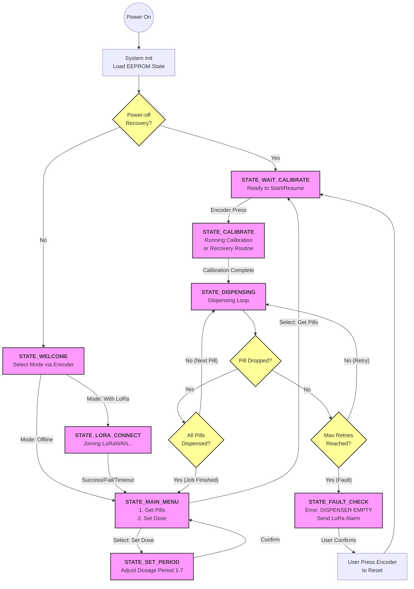

# Pill Dispenser IoT Project

## Project Structure
```text
Pill_Dispenser_Project/
├── CMakeLists.txt              # CMake build configuration
├── README.md                   # Project documentation
├── lorareceive.py              # Python script for LoRaWAN data reception
├── .gitignore                  # Git ignore rules
├── docs/                       # Documentation files
│   ├── flowchart.md            # Detailed operation flowchart
│   ├── lora_commands.md        # LoRa AT commands reference
│   └── ...
├── src/                        # Source code
│   ├── main.c                  # Entry point (System Init & Main Loop)
│   ├── config.h                # GPIO mappings and global configuration
│   ├── drivers/                # Hardware Abstraction Layer (HAL)
│   │   ├── appkey.h            # LoRa AppKey (Not tracked by git)
│   │   ├── eeprom.c/h          # I2C EEPROM driver (Logs & State saving)
│   │   ├── encoder&button.c/h  # Rotary encoder & Button inputs
│   │   ├── iuart.c/h           # Interrupt-driven UART driver
│   │   ├── led.c/h             # PWM LED control (Breathing/Blinking)
│   │   ├── lora.c/h            # LoRaWAN logic (AT command wrapper)
│   │   ├── motor.c/h           # Stepper motor driver
│   │   ├── oled.c/h            # I2C OLED display driver
│   │   └── sensor.c/h          # Opto-fork & Piezo sensor driver
│   └── logic/                  # Business Logic Layer
│       ├── dispenser.c/h       # Dispenser mechanics (Calibration/Stepping)
│       └── statemachine.c/h    # Main State Machine (UI & Process Control)
```
Project Workflow:

